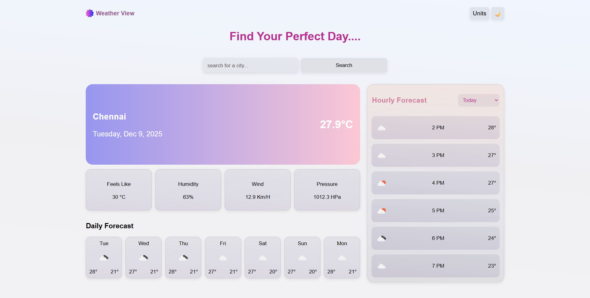
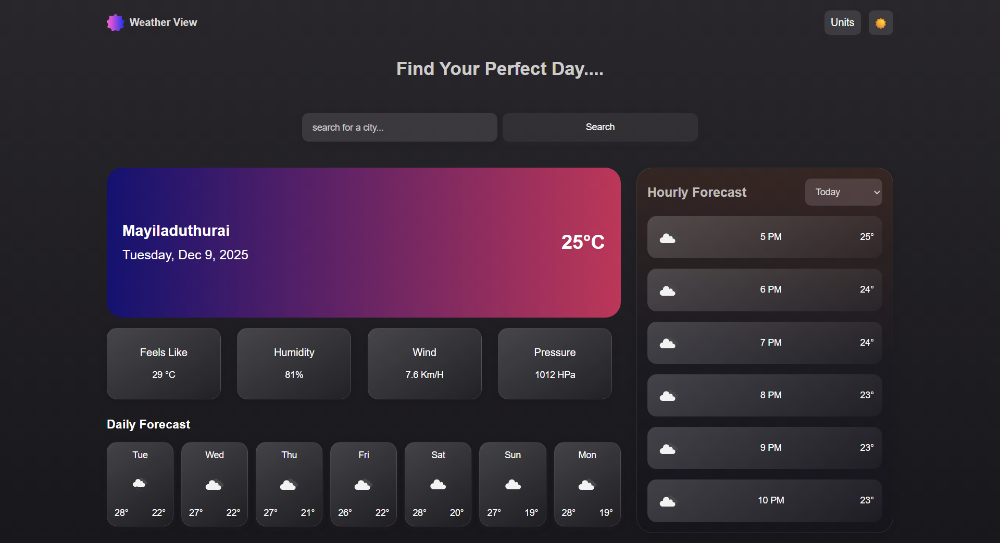

# Weather View 🌤️

**Weather View** is a responsive, feature-rich weather dashboard application built with **Vanilla JavaScript**, **HTML**, and **CSS**. It allows users to search for cities worldwide and view detailed current weather conditions, along with daily and hourly forecasts.

## 🚀 Live Demo

**[Click here to view the live site](weather-view-nine.vercel.app)**

---

## 📸 Screenshots

### 🌞 Light Theme


### 🌚 Dark Theme


---

## 🚀 Features

* **Real-time Weather Data:** Displays current temperature, "feels like" temperature, humidity, wind speed, and atmospheric pressure.
* **City Search:** Integrated search functionality powered by the Geocoding API to find weather for any location.
* **Hourly Forecast:** Detailed hourly weather breakdown for the next 7 days, selectable via a dropdown menu.
* **Daily Forecast:** A 7-day overview of high/low temperatures and weather conditions.
* **Dark/Light Mode:** Toggle between a modern dark theme and a clean light theme. The preference is saved in your browser's local storage.
* **Unit Conversion:** Switch seamlessly between **Metric** (°C, km/h) and **Imperial** (°F, mph) units.
* **Responsive Design:** Fully responsive layout that adapts to mobile, tablet, and desktop screens.
* **Skeleton Loading:** Smooth loading states with shimmer effects while fetching data to improve UX.

## 🛠️ Technologies Used

* **HTML5:** Semantic structure.
* **CSS3:** Custom styling using CSS Variables, Flexbox, Grid, and media queries for responsiveness.
* **JavaScript (ES6+):** Modular architecture using ES Modules (`import`/`export`) for clean code organization.
* **Day.js:** Used for easy date and time formatting.

## 📡 APIs

This project relies on the following free and open APIs:

1.  **[Open-Meteo API](https://open-meteo.com/):**
    * Fetches Weather Forecast data (Current, Hourly, and Daily).
    * Fetches Geocoding data (Latitude/Longitude lookup for city names).
2.  **[OpenWeatherMap](https://openweathermap.org/):**
    * Used solely for retrieving weather icon images corresponding to WMO codes.

---

## 📂 Project Structure

```text
/
├── index.html                  # Main HTML structure
├── styles/
│   └── weather-view-index.css  # Global styles and variables
├── scripts/
│   ├── weather-view.js         # Main application logic & event listeners
│   ├── current-weather.js      # Renders current weather section
│   ├── daily-forecast.js       # Renders daily forecast section
│   ├── hourly-forecast.js      # Renders hourly forecast section
│   └── utilities/
│       ├── weather-url-modifier.js    # Handles unit conversion in URLs
│       └── weather-icon-owncode-url.js # Maps WMO codes to icons
├── data/
│   ├── current-weather-data.js # Fetches current weather
│   ├── daily-forecast-data.js  # Fetches daily data
│   ├── hourly-forecast-data.js # Fetches hourly data
│   └── geocoding-api-data.js   # Fetches location coordinates
└── images/
    └── weather-view-logo.png   # Application logo
